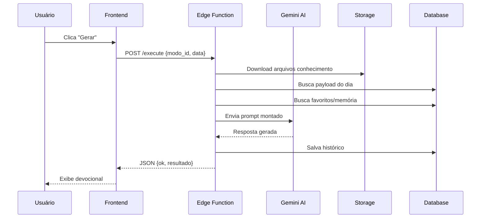

# Arquitetura - Devocional PVC

## Visão Geral

```
┌─────────────────────────────────────────────────────────────────┐
│                         FRONTEND                                │
│  ┌──────────────┐  ┌──────────────┐  ┌──────────────┐          │
│  │    Next.js   │  │    React     │  │  TailwindCSS │          │
│  │   App Router │  │     19.x     │  │     v4       │          │
│  └──────────────┘  └──────────────┘  └──────────────┘          │
│                                                                 │
│  ┌──────────────────────────────────────────────────────────┐  │
│  │                    src/components/                        │  │
│  │  ├── ui/          (DashboardCard, Skeleton, Toast, etc)   │  │
│  │  ├── LazyComponents.tsx (lazy loading)                    │  │
│  │  └── NotificationManager.tsx (push notifications)         │  │
│  └──────────────────────────────────────────────────────────┘  │
└─────────────────────────────────────────────────────────────────┘
                              │
                              ▼
┌─────────────────────────────────────────────────────────────────┐
│                     SUPABASE EDGE FUNCTIONS                     │
│  ┌──────────────────────────────────────────────────────────┐  │
│  │                    /execute (Principal)                   │  │
│  │  ├── index.ts          (Entry point)                      │  │
│  │  ├── variability.ts    (Ângulos, temperaturas)            │  │
│  │  ├── prompt-builder.ts (Construtor de prompts)            │  │
│  │  ├── gemini-client.ts  (API Gemini)                       │  │
│  │  ├── storage-helper.ts (Cache de arquivos)                │  │
│  │  ├── memory-helper.ts  (Favoritos/histórico)              │  │
│  │  └── streaming-helper.ts (SSE streaming)                  │  │
│  └──────────────────────────────────────────────────────────┘  │
│  ┌──────────────────────────────────────────────────────────┐  │
│  │                    /health (Monitoramento)                │  │
│  │  └── index.ts          (Health checks)                    │  │
│  └──────────────────────────────────────────────────────────┘  │
└─────────────────────────────────────────────────────────────────┘
                              │
                              ▼
┌─────────────────────────────────────────────────────────────────┐
│                        SUPABASE CORE                            │
│  ┌────────────────┐  ┌────────────────┐  ┌────────────────┐    │
│  │    Database    │  │    Storage     │  │      Auth      │    │
│  │   PostgreSQL   │  │   (pvc bucket) │  │   (opcional)   │    │
│  └────────────────┘  └────────────────┘  └────────────────┘    │
└─────────────────────────────────────────────────────────────────┘
                              │
                              ▼
┌─────────────────────────────────────────────────────────────────┐
│                       EXTERNAL APIS                             │
│  ┌────────────────┐  ┌────────────────┐  ┌────────────────┐    │
│  │   Gemini AI    │  │   Bible API    │  │   RSS Feeds    │    │
│  │  (geração)     │  │   (versículos) │  │  (devocionais) │    │
│  └────────────────┘  └────────────────┘  └────────────────┘    │
└─────────────────────────────────────────────────────────────────┘
```

## Fluxo de Dados



## Tabelas do Banco

| Tabela | Descrição |
|--------|-----------|
| `modos` | Configuração dos modos de geração |
| `payload_do_dia` | View com leitura diária |
| `leitura_do_dia` | Passagens com insights |
| `historico_geracoes` | Histórico de devocionais |
| `favoritos_mensagens` | Mensagens individuais favoritas |

## Sistema de Variabilidade

```
ÂNGULOS (4)
├── ESPELHO_MODERNO (tradução cultural)
├── RAIZ_HISTORICA (termos bíblicos)
├── RAIO_X_EMOCIONAL (foco sentimento)
└── LENTE_DE_JESUS (cristocêntrico)

TEMPERATURAS (4)
├── DEVOCIONAL (oração, entrega)
├── SAPIENCIAL (conselho, ação)
├── PROFETICO (urgente, denúncia)
└── CONSOLADOR (graça, acolhimento)

ARQUETIPOS (via archetype-selector.ts)
└── Estrutura do texto
```

## CI/CD Pipeline

```
GitHub Push (main)
     │
     ▼
┌─────────┐    ┌─────────┐    ┌─────────────┐    ┌───────────────┐
│  Lint   │───▶│  Build  │───▶│ Deploy Edge │───▶│ Deploy Vercel │
└─────────┘    └─────────┘    └─────────────┘    └───────────────┘
```

## Decisões Técnicas

| Decisão | Motivo |
|---------|--------|
| Next.js App Router | SSR, RSC, melhor SEO |
| Supabase Edge | Latência baixa, sem servidor |
| Gemini 3 Flash | Custo-benefício, velocidade |
| TailwindCSS v4 | Sintaxe moderna, layers |
| Vitest | Rápido, compatível Vite |
